# School scheduler app on Django
This Django project offers a simple solution for managing events and support tickets with Redis caching.

## Examples pictures
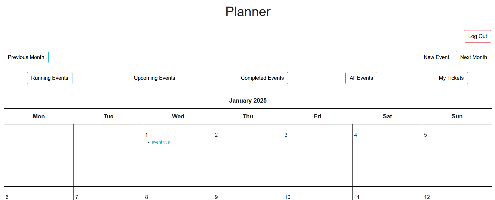
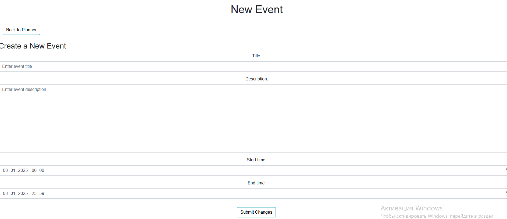
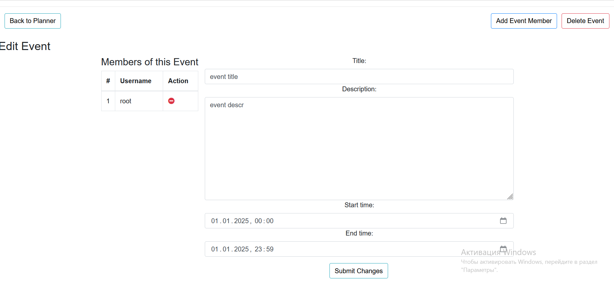
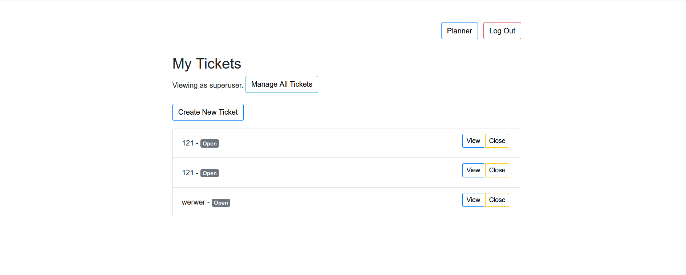
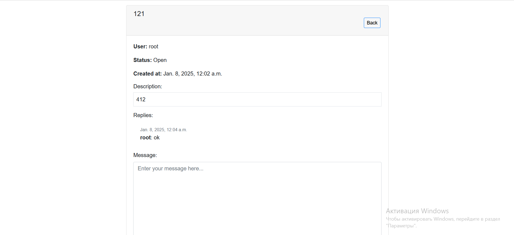

## Планирование проекта
### ERD
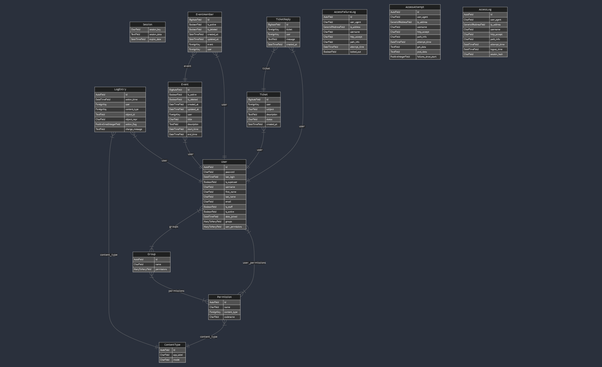

### Class diagram
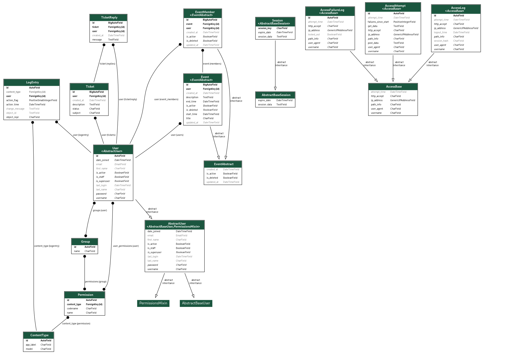

### Activity diagram
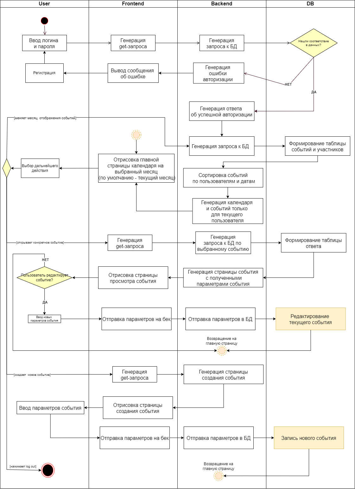

### Sequence diagram
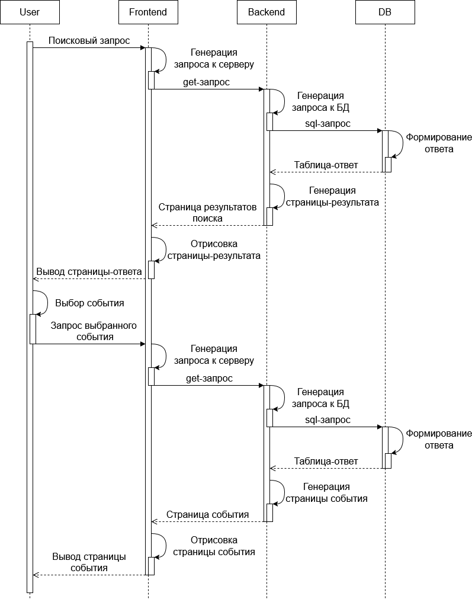

### Scenario diagram
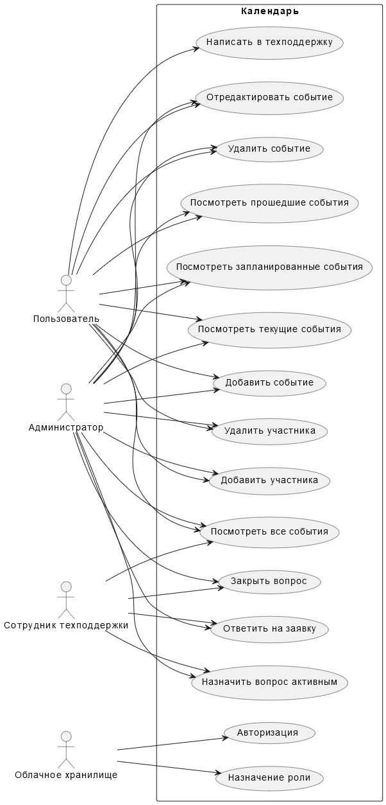

### Gantt chart
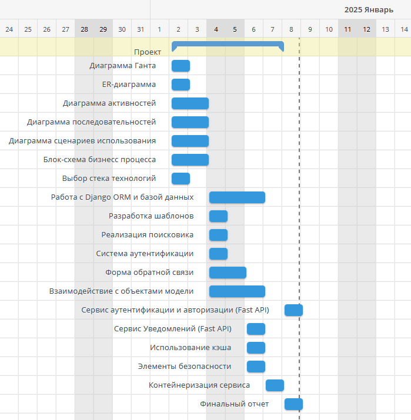

### Block diagram of the business process
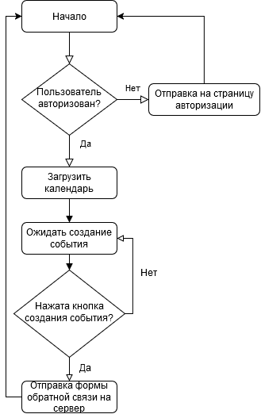

## How To Use It
- Install vagrant.
- Clone this repository manually
```
git clone https://gitlab.digital.mephi.ru/w6xsnm/scheduler.git
```
- Enter into to the 'project/'
- Check if vb.memory and vb.cpus are optimal for your system
- Change 'jammy64.box' to 'ubuntu/jammy64' or any other ubuntu-based machine. Alternatively, you can install jammy64.box from Vagrant Cloud
- Create .env file for a project. You can see example in 'public/env'
- Start virtual machine
```
vagrant up
```
- Open http://localhost:8080 or https://localhost:8443 in your browser
- Allow your browser open this page

## Usage of notifying system
Set all necessary env variables, provide proper 'smtp_password' in 'project/Vagrantfile'. It will be used to sign in your gmail account.
